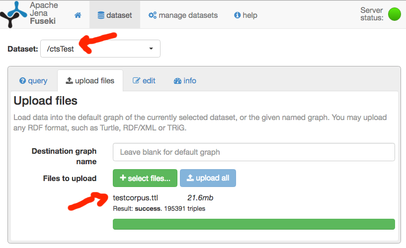

## 0. Prerequisites for running tests ##

Integration tests use `gretty` to start up a fuseki SPARQL endpoint.  This requires:

- Java 7 or more recent
- set the variable named `FUSEKI_BASE` to point to the directory `cs2/fuseki/fusekibase` on your system
- before testing any of the `cs2` services, you must run  `gradle configure` to configure the fuseki database

## Testing `cts2:sparqlcts` ##

At present, a full test suite is available for `sparqlcts`.

### 1. Load test data into fuseki

The project's test suite expects to find data available from [this github repository](https://github.com/cite-architecture/cite_test_ttl).  First clone or download that repository, and find the TTL file `testsuite/textcorpus/ttl/testcorpus.ttl`.

Then, prepare fuseki with the test data set:

1. Start the gretty server farm: `gradle sparqlcts:farmRun`
2. Load the test data:
    1. Point a web browser at <http://localhost:8080/fuseki>.
    2. For the `ctsTest` dataset,  choose `add data`.
    3. On the following screen, choose `select files…`, and choose the `testcorpus.ttl` you  downloaded or cloned.
    4. Choose `upload all`.  When your upload is complete, you should see something like this, with `ctsTest` chosen as your dataset, and `testcorpus.ttl` as your uploaded file: 
3. Stop sparql from your terminal with `control-c`

### 2. Run the tests ##

To run all unit test and integration tests within the sparqlcts subproject:

    gradle sparqlcts:farmIntegrationTest

The shiro security environment where the server farm runs does not fully release at the end of *successful* integration tests.  (It does release correctly if tests fail, however!)  When you see this message at the end of integration tests:

    INFO  Cleaning up Shiro Environment

your tests have completed successfully, and you can safely use  `control-c`  in your terminal to stop the test process.

### 3. Optional

You can use the CTS Validator (on github at <https://github.com/cite-architecture/ctsvalidator>) to run tests for every CTS request against a server at a specified address.  The CTS service is expected to have the same test data set loaded.
